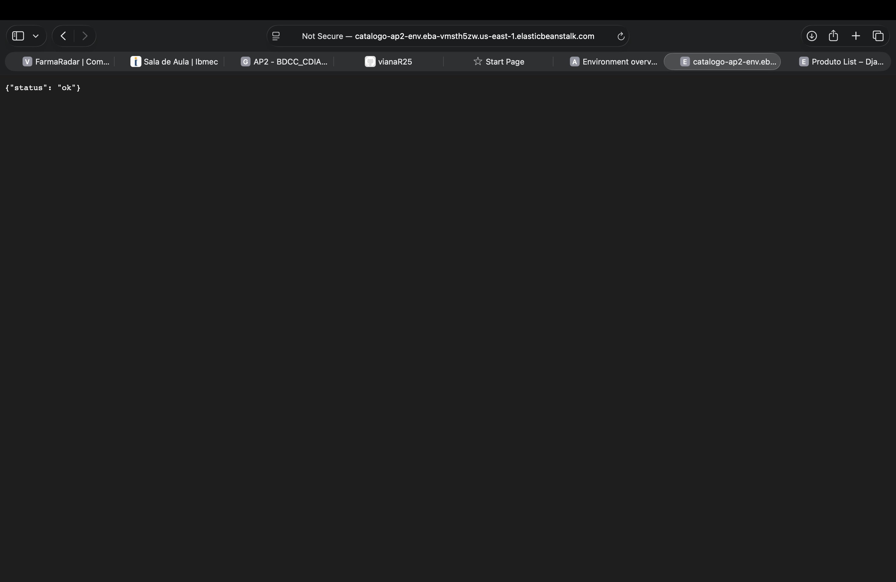
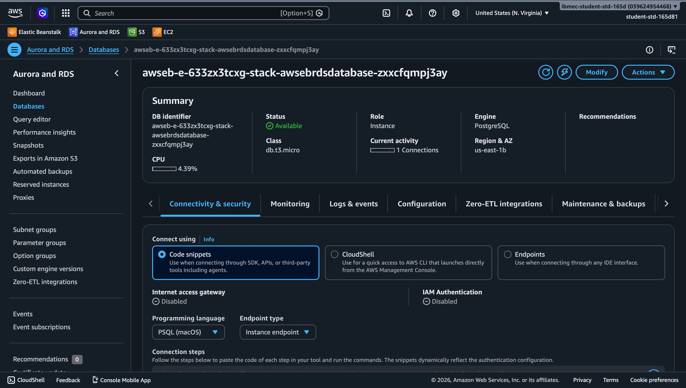
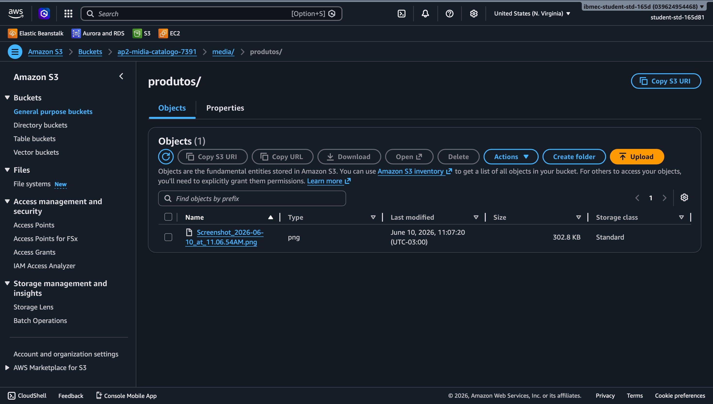
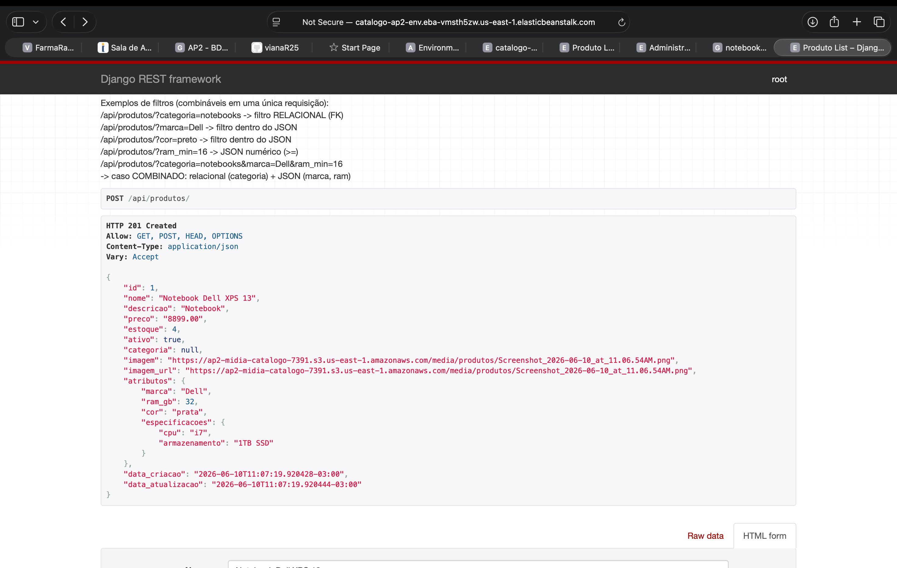
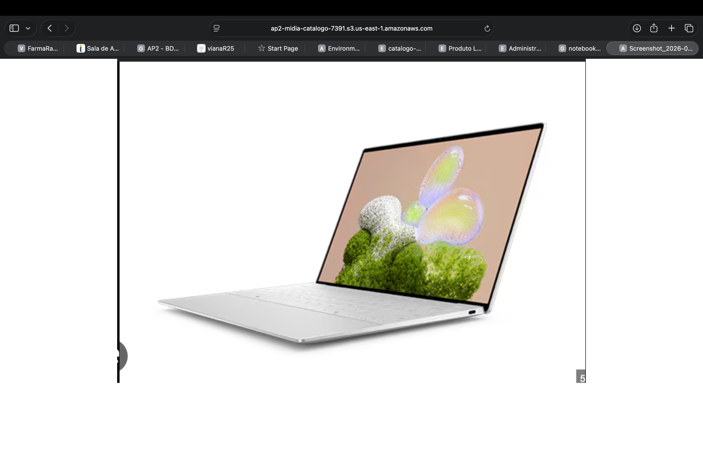
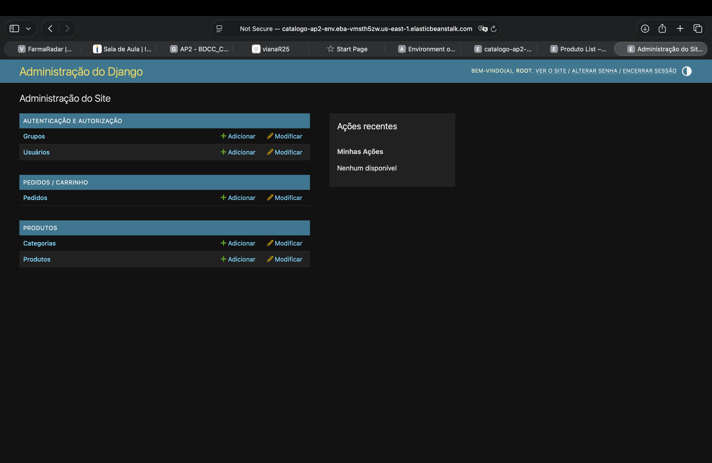
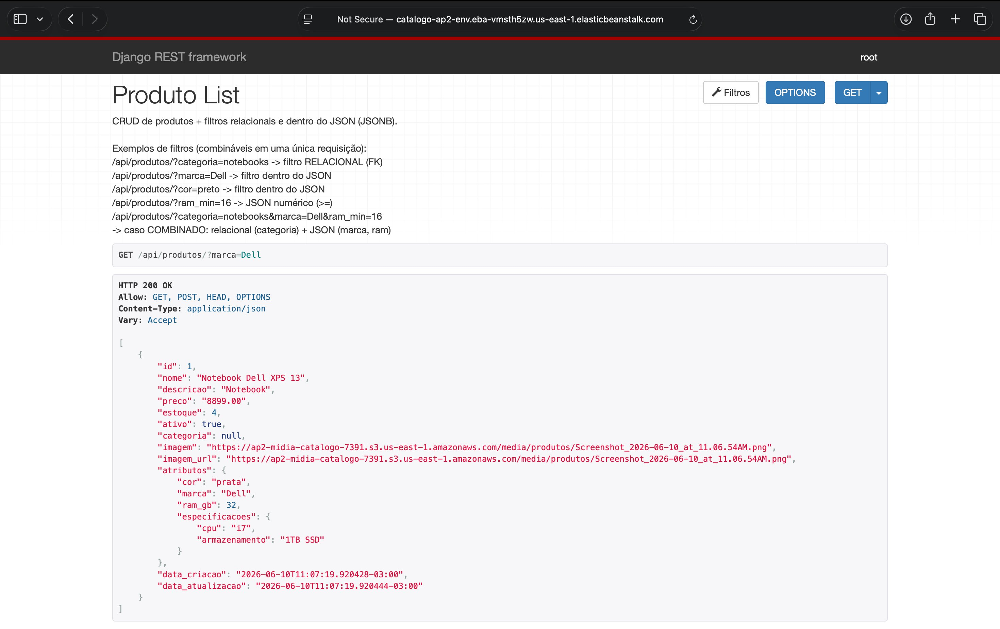
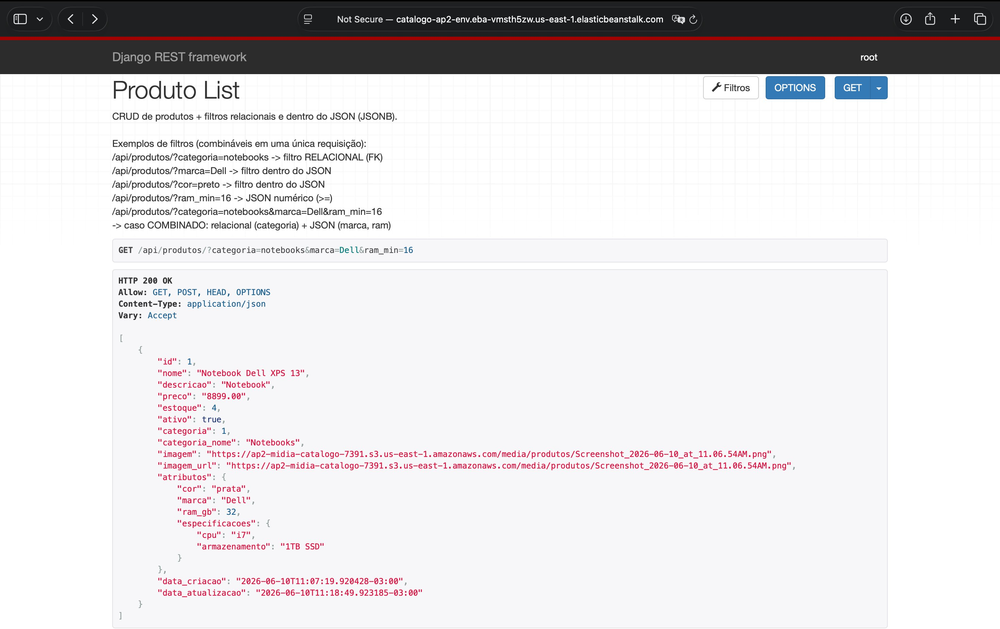
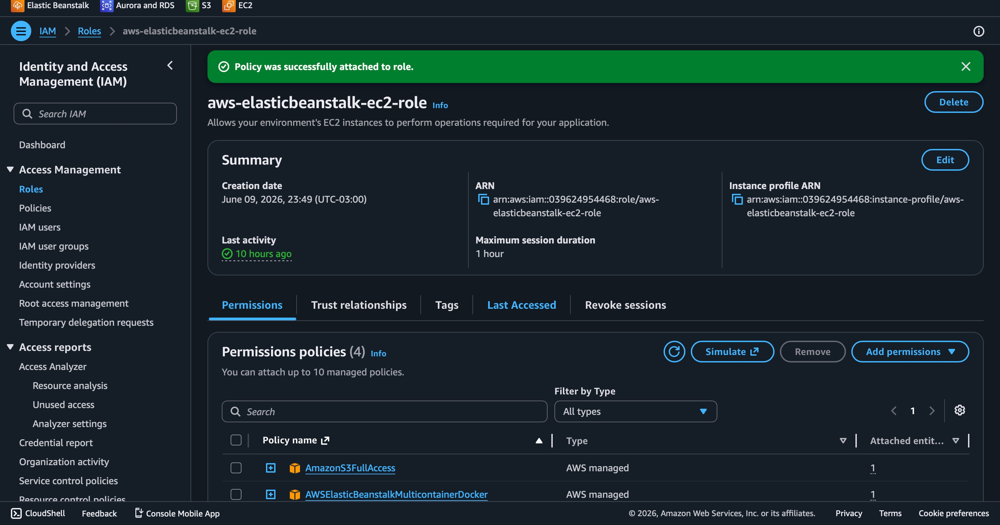

# Catálogo / E-commerce — AP2 (Django REST + AWS RDS PostgreSQL + S3)

API REST de um pequeno e-commerce com carrinho de compras, evoluída a partir do
projeto **RestEB**. Banco de dados gerenciado no **AWS RDS PostgreSQL**, mídia dos
produtos no **AWS S3** e deploy no **AWS Elastic Beanstalk**.

> **Link da API em produção:** <http://catalogo-ap2-env.eba-vmsth5zw.us-east-1.elasticbeanstalk.com/>
>
> Endpoints principais: [`/api/produtos/`](http://catalogo-ap2-env.eba-vmsth5zw.us-east-1.elasticbeanstalk.com/api/produtos/) · [`/api/pedidos/`](http://catalogo-ap2-env.eba-vmsth5zw.us-east-1.elasticbeanstalk.com/api/pedidos/) · [`/admin/`](http://catalogo-ap2-env.eba-vmsth5zw.us-east-1.elasticbeanstalk.com/admin/)

---

## 1. Arquitetura da solução (RestEB → AP2)

| Camada            | RestEB (base)                       | AP2 (esta entrega)                                   |
|-------------------|-------------------------------------|------------------------------------------------------|
| Modelo de dados   | `Produto` apenas                    | `Categoria`, `Produto` (+FK, +estoque, +JSON), `Pedido`, `ItemPedido` (carrinho) |
| Banco de dados    | SQLite (arquivo local)              | **PostgreSQL no AWS RDS** (SQLite/Postgres local em dev) |
| Mídia (imagens)   | Disco local (`/media`)              | **AWS S3** via `django-storages` + `boto3`           |
| Configuração      | Valores fixos no `settings.py`      | **Variáveis de ambiente** para todos os segredos     |
| Deploy            | Elastic Beanstalk                   | Elastic Beanstalk + RDS + S3 integrados              |

```
                 ┌──────────────────────────────┐
   Cliente  ───► │  Elastic Beanstalk (Django)  │
   (HTTP)        │  gunicorn + DRF              │
                 └──────────┬─────────┬─────────┘
                            │         │
              dados relacionais   uploads de mídia
                            │         │
                   ┌────────▼──┐  ┌───▼────────┐
                   │ RDS       │  │ S3 (bucket)│
                   │ PostgreSQL│  │  /media/   │
                   └───────────┘  └────────────┘
```

### Modelo de dados

- **Categoria** — `nome`, `slug`, `descricao`.
- **Produto** — `categoria` (FK), `nome`, `descricao`, `preco`, `estoque`,
  `ativo`, `imagem` (S3 em produção), `atributos` (**JSONField → JSONB**),
  `data_criacao`, `data_atualizacao`.
- **Pedido** (carrinho) — `cliente_nome`, `cliente_email`, `status`
  (`ABERTO`/`PAGO`/`ENVIADO`/`CANCELADO`), `total` (calculado).
- **ItemPedido** — `pedido` (FK), `produto` (FK), `quantidade`,
  `preco_unitario` (snapshot do preço), `subtotal` (calculado).

O **carrinho** é um `Pedido` com status `ABERTO`. Ao finalizar a compra ele passa
para `PAGO`.

---

## 2. Endpoints da API

Base: `/api/`

| Método | Rota                                   | Descrição                               |
|--------|----------------------------------------|-----------------------------------------|
| GET/POST | `/api/categorias/`                   | Lista / cria categorias                 |
| GET/PUT/DELETE | `/api/categorias/{id}/`        | Detalha / atualiza / remove categoria   |
| GET/POST | `/api/produtos/`                     | Lista / cria produtos (POST com imagem = multipart) |
| GET/PUT/PATCH/DELETE | `/api/produtos/{id}/`    | CRUD de produto                         |
| GET/POST | `/api/pedidos/`                      | Lista / cria pedidos (carrinho)         |
| GET/PUT/DELETE | `/api/pedidos/{id}/`           | CRUD de pedido                          |
| POST   | `/api/pedidos/{id}/adicionar_item/`    | Adiciona produto ao carrinho            |
| POST   | `/api/pedidos/{id}/remover_item/`      | Remove item do carrinho                 |
| POST   | `/api/pedidos/{id}/finalizar/`         | Finaliza a compra (ABERTO → PAGO)       |
| GET    | `/admin/`                              | Django Admin                            |
| GET    | `/`                                    | Health check (`{"status":"ok"}`)        |

### Filtros de produto (relacionais e dentro do JSON)

```
GET /api/produtos/?categoria=notebooks          # filtro RELACIONAL (FK)
GET /api/produtos/?marca=Dell                    # filtro dentro do JSON
GET /api/produtos/?cor=preto                     # filtro dentro do JSON
GET /api/produtos/?ram_min=16                    # JSON numérico (ram_gb >= 16)
GET /api/produtos/?cpu=i5                         # chave aninhada (especificacoes.cpu)
GET /api/produtos/?categoria=notebooks&marca=Dell&ram_min=16   # COMBINADO
GET /api/produtos/?search=notebook               # busca textual em nome/descrição
GET /api/produtos/?ordering=preco                # ordenação
```

### Exemplos de requisição

```bash
# Criar produto com imagem (multipart) + atributos JSON
curl -X POST http://127.0.0.1:8000/api/produtos/ \
  -F "nome=Notebook Dell XPS 13" \
  -F "preco=8999.00" -F "estoque=4" \
  -F 'atributos={"marca":"Dell","ram_gb":32,"cor":"prata","especificacoes":{"cpu":"i7"}}' \
  -F "imagem=@/caminho/foto.jpg"

# Fluxo de carrinho
curl -X POST http://127.0.0.1:8000/api/pedidos/ \
  -H "Content-Type: application/json" \
  -d '{"cliente_nome":"Maria","cliente_email":"maria@example.com"}'

curl -X POST http://127.0.0.1:8000/api/pedidos/1/adicionar_item/ \
  -H "Content-Type: application/json" -d '{"produto":1,"quantidade":2}'

curl -X POST http://127.0.0.1:8000/api/pedidos/1/finalizar/
```

---

## 3. Execução local (passo a passo)

### Opção rápida (script de bootstrap, usa SQLite)

```bash
bash scripts/bootstrap_local.sh
source .venv/bin/activate
python manage.py runserver
```

### Manual

```bash
python3 -m venv .venv
source .venv/bin/activate            # Windows: .venv\Scripts\activate
pip install -r requirements.txt

cp .env.example .env                 # ajuste os valores conforme necessário

# Para subir sem PostgreSQL local, deixe USE_SQLITE=True no .env.
# Para usar PostgreSQL local, deixe USE_SQLITE=False e preencha POSTGRES_*.

python manage.py migrate
python manage.py seed_demo           # dados de exemplo (opcional)
python manage.py runserver
```

- API: <http://127.0.0.1:8000/api/produtos/>
- Admin: <http://127.0.0.1:8000/admin/>

### Rodar os testes

```bash
USE_SQLITE=True python manage.py test
```

---

## 4. Criação do usuário administrador (root)

Há duas formas:

**a) Comando padrão do Django (interativo):**

```bash
python manage.py createsuperuser
```

**b) Comando `criar_admin` (não interativo, ideal para produção/EB):**

```bash
DJANGO_SUPERUSER_USERNAME=root \
DJANGO_SUPERUSER_EMAIL=root@example.com \
DJANGO_SUPERUSER_PASSWORD=umaSenhaForte \
python manage.py criar_admin
```

No Elastic Beanstalk, basta definir essas três variáveis em
**Configuration → Software → Environment properties**. O `.ebextensions`
executa `criar_admin` automaticamente a cada deploy (idempotente).

---

## 5. Deploy na AWS (passo a passo)

### 5.1. Banco — AWS RDS PostgreSQL

1. Console **RDS → Create database → PostgreSQL** (Free tier para laboratório).
2. Defina **Master username** e **Master password** e anote-os.
3. **DB instance class:** `db.t4g.micro` (ou similar). **Storage:** 20 GiB.
4. **Public access:** conforme sua necessidade (para conectar do EB, o mais
   simples é o RDS estar na mesma VPC do ambiente).
5. No **Security Group** do RDS, libere a porta **5432** para o Security Group
   do ambiente Elastic Beanstalk (ou para seu IP, se for testar localmente).
6. Aguarde o status **Available** e copie o **endpoint** da instância.

> **Recomendado:** criar o RDS **junto com o ambiente EB** (seção 5.3, opção A).
> Assim o Beanstalk injeta automaticamente as variáveis
> `RDS_DB_NAME`, `RDS_USERNAME`, `RDS_PASSWORD`, `RDS_HOSTNAME`, `RDS_PORT`,
> que o `settings.py` já lê.

### 5.2. Mídia — AWS S3

1. Console **S3 → Create bucket**. Nome único, ex.: `ap2-midia-SEUNOME`.
   Região, ex.: `us-east-1`.
2. **Acesso:** para servir as imagens diretamente por URL pública, desmarque
   "Block all public access" e adicione uma **Bucket policy** de leitura
   pública em `media/*` (exemplo abaixo). Para bucket **privado**, mantenha o
   bloqueio e use `AWS_QUERYSTRING_AUTH=True` (URLs assinadas).
3. Crie um usuário **IAM** com permissão de escrita no bucket (ex.: política
   `AmazonS3FullAccess` em laboratório, ou uma política restrita ao bucket) e
   gere **Access Key ID** e **Secret Access Key**.

Exemplo de _bucket policy_ (leitura pública apenas da pasta `media/`):

```json
{
  "Version": "2012-10-17",
  "Statement": [
    {
      "Sid": "PublicReadMedia",
      "Effect": "Allow",
      "Principal": "*",
      "Action": "s3:GetObject",
      "Resource": "arn:aws:s3:::SEU-BUCKET/media/*"
    }
  ]
}
```

### 5.3. Aplicação — AWS Elastic Beanstalk

**Opção A — criar ambiente já com RDS (mais simples):**

1. Console **Elastic Beanstalk → Create application** (plataforma **Python 3.12**).
2. Na criação, em **Database**, adicione um banco **PostgreSQL**.
3. Conclua a criação. As variáveis `RDS_*` são injetadas automaticamente.

**Opção B — anexar um RDS criado à parte:** em **Configuration → Software →
Environment properties**, adicione manualmente `RDS_DB_NAME`, `RDS_USERNAME`,
`RDS_PASSWORD`, `RDS_HOSTNAME`, `RDS_PORT`.

**Variáveis de ambiente a definir no EB** (Configuration → Software):

```
DJANGO_DEBUG=False
DJANGO_SECRET_KEY=<uma-chave-forte>
DJANGO_ALLOWED_HOSTS=<seu-dominio>.elasticbeanstalk.com,.elasticbeanstalk.com
DJANGO_CSRF_TRUSTED_ORIGINS=https://<seu-dominio>.elasticbeanstalk.com

USE_S3=True
AWS_ACCESS_KEY_ID=<sua-access-key>
AWS_SECRET_ACCESS_KEY=<sua-secret-key>
AWS_STORAGE_BUCKET_NAME=<seu-bucket>
AWS_S3_REGION_NAME=us-east-1
AWS_QUERYSTRING_AUTH=False        # True se o bucket for privado

DJANGO_SUPERUSER_USERNAME=root
DJANGO_SUPERUSER_EMAIL=root@example.com
DJANGO_SUPERUSER_PASSWORD=<senha-forte>
```

> Não defina `RDS_*` aqui se o banco foi criado pelo próprio EB (opção A).

**Gerar e enviar o pacote:**

```bash
bash scripts/build_zip.sh         # gera app.zip com arquivos na raiz
```

Faça **Upload and deploy** do `app.zip` pelo console (ou `eb deploy` via CLI).
O `.ebextensions/django.config` roda `migrate`, `collectstatic` e `criar_admin`
no deploy. Aguarde o ambiente ficar **Green**.

### 5.4. Validação

- `GET /` → `{"status": "ok"}`
- `GET /api/produtos/` → lista
- `POST /api/produtos/` com `imagem` → arquivo aparece no bucket S3 e a
  `imagem_url` aponta para o S3
- `/admin/` → login com o usuário `root`
- CRUD completo (GET/POST/PUT/DELETE) nos endpoints

---

## 6. Evidências obrigatórias

Ambiente em produção: `catalogo-ap2-env.eba-vmsth5zw.us-east-1.elasticbeanstalk.com`
(Elastic Beanstalk, região us-east-1).

**API pública no ar (health check)**



**Console RDS — instância PostgreSQL `Available` (e conectada à aplicação)**



**Console S3 — arquivo de mídia persistido em `media/produtos/`**



**Requisição da API criando produto com mídia (`imagem_url` apontando para o S3)**



**Imagem servida diretamente pelo S3 (leitura pública via bucket policy)**



**Django Admin com login do administrador (root)**



**Consulta com filtro dentro do JSON (`?marca=Dell`) — JSONB no PostgreSQL**



**Caso combinado: filtro relacional (categoria) + JSON (marca + ram) numa única requisição (bônus)**



**Boas práticas de segurança — perfil IAM da instância com acesso ao S3 (sem chaves no repositório)**



---

## 7. JSONField / JSONB — quando usar (bônus)

O campo `Produto.atributos` é um `JSONField`, que no PostgreSQL é persistido como
**JSONB**. Ele guarda atributos que variam de produto para produto (marca,
`ram_gb`, cor, especificações), evitando dezenas de colunas opcionais.

- **Use colunas relacionais** para dados estruturados, consultados/filtrados com
  frequência e que valem regras de integridade (preço, estoque, categoria,
  status). São indexáveis e tipados.
- **Use JSONField/JSONB** para atributos dinâmicos e heterogêneos, que mudam por
  categoria de produto e não exigem esquema fixo (especificações técnicas).

Consultas dentro do JSON (ver `produtos/views.py`):

```python
Produto.objects.filter(atributos__marca__iexact='Dell')          # 1
Produto.objects.filter(atributos__ram_gb__gte=16)                # 2 (numérico)
Produto.objects.filter(categoria__slug='notebooks',
                       atributos__marca__iexact='Dell')          # combinado
Produto.objects.filter(atributos__especificacoes__cpu='i5')      # aninhado
```

---

## 8. Troubleshooting

| Sintoma | Causa provável / solução |
|---------|--------------------------|
| Ambiente EB **Degraded/Red** | Veja os logs em **Logs → Request logs**. Geralmente falta variável de ambiente do banco ou dependência. |
| `psycopg`/conexão recusada com RDS | Security Group do RDS não libera a porta **5432** para o EB; ou `RDS_HOSTNAME` errado. |
| `CSRF verification failed` no admin | Defina `DJANGO_CSRF_TRUSTED_ORIGINS=https://<seu-dominio>` (com esquema). |
| Imagem não persiste no S3 | `USE_S3` não está `True`, credenciais IAM inválidas, ou bucket/região errados. |
| Imagem salva mas não abre (403) | Bucket privado: use `AWS_QUERYSTRING_AUTH=True`, ou ajuste a bucket policy de leitura pública em `media/*`. |
| `DisallowedHost` | Inclua o domínio em `DJANGO_ALLOWED_HOSTS`. |
| Estáticos do admin sem CSS | Confirme o mapeamento `/static: staticfiles` no `.ebextensions` e o `collectstatic`. |

---

## 9. Estrutura do projeto

```
.
├── catalogo/              # projeto Django (settings, urls, wsgi)
├── produtos/              # app: Categoria, Produto (+JSONField), filtros, admin
│   └── management/commands/  criar_admin.py, seed_demo.py
├── pedidos/               # app: Pedido, ItemPedido (carrinho), ações
├── .ebextensions/         # config do Elastic Beanstalk (migrate/collectstatic/admin)
├── scripts/               # bootstrap_local.sh, build_zip.sh
├── docs/AP2.md            # documentação da AP2
├── Procfile               # gunicorn
├── requirements.txt
├── .env.example
└── README.md
```

## 10. Referências

- [Django REST Framework](https://www.django-rest-framework.org/)
- [Deploy Django no Elastic Beanstalk](https://docs.aws.amazon.com/pt_br/elasticbeanstalk/latest/dg/create-deploy-python-django.html)
- [Amazon RDS para PostgreSQL](https://docs.aws.amazon.com/pt_br/AmazonRDS/latest/UserGuide/CHAP_PostgreSQL.html)
- [Amazon S3](https://docs.aws.amazon.com/pt_br/AmazonS3/latest/userguide/Welcome.html)
- [django-storages (S3)](https://django-storages.readthedocs.io/en/latest/backends/amazon-S3.html)
